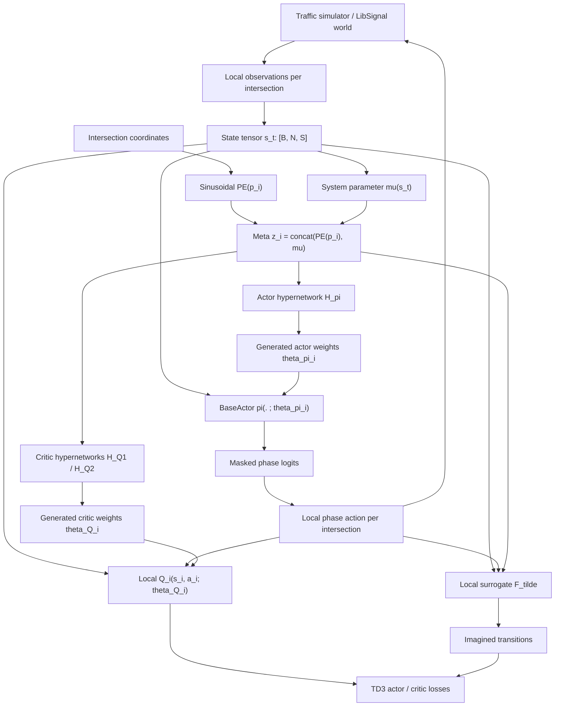

# HyperLight 模型架構說明

這份文件是 `HyperLight` 的交接文件。它假設讀者只知道本專案是 LibSignal 的 Traffic Signal Control (TSC) 任務，以及使用者提供的 `HyperMARL.pdf`。文件不依賴其他實驗分支或其他模型背景；若之後上下文容量不足，可以直接把本檔交給下一個 AI 或開發者接手。

## 1. 目標

`HyperLight` 的目標是把 `HyperMARL.pdf` 的方法精神實作到交通號誌控制：

- 多個路口視為多個 local agents。
- 每個 agent 只根據自己的 local state 輸出 local action。
- 每個 agent 的 policy / value function 不直接共享同一組固定權重，而是由 hypernetwork 根據 agent 位置與系統參數生成。
- 使用 sinusoidal positional encoding 表示 agent relative position。
- 使用 system parameter `mu` 讓 policy / value function 能根據不同交通系統狀態調整。
- 使用 TD3-style actor-critic 作為核心強化學習更新。
- 使用 local surrogate dynamics 實作 model-based extension，對應論文中的 MB-HyperMARL。

目前主要檔案：

- `agent/hyperlight.py`：完整 HyperLight agent，包含 TSC agent 介面、PE、system `mu`、hyper actor、hyper critic、TD3 update、surrogate model。
- `configs/tsc/hyperlight.yml`：預設超參數。
- `agent/__init__.py`：註冊 `HyperLightAgent`。

執行方式：

```bash
python3 run.py -a hyperlight -w cityflow -n cityflow4x4 --prefix hyperlight_exp
```

## 2. 重要設計邊界

目前 `HyperLight` 是 self-contained implementation：

- `HyperLightAgent` 直接繼承 LibSignal 的 `RLAgent`。
- 不繼承其他 traffic control agent。
- 不引用其他模型檔案中的訓練邏輯。
- 不加入 `HyperMARL.pdf` 之外的額外訊息傳遞模組。
- 只保留 `HyperMARL.pdf` 中必要的核心：`PE(position)`、system parameter `mu`、hypernetwork-generated actor / critic、TD3、surrogate model。

仍然共用的通用模組：

- `agent/actor.py` 的 `BaseActor`：被 hypernetwork 生成權重的 base policy network。
- `agent/critic.py` 的 `HyperTwinCritic`：hypernetwork-generated twin local critics。
- `agent/hypernetwork.py` 的 `HyperNetwork`：產生 actor weights。
- `generator/*`：LibSignal 的 observation / reward / phase generator。

這些是通用 building blocks，不代表沿用其他 agent 架構。

## 3. HyperMARL.pdf 到 HyperLight 的映射

| 論文概念 | 論文符號 | HyperLight 實作 | 程式位置 |
| --- | --- | --- | --- |
| 多 agent 分散控制 | `i = 1...N` | 每個 intersection 是一個 local agent。 | `self.sub_agents = len(world.intersections)` |
| local state | `y_{i,t}` | 單一路口的 lane count / waiting count / current phase。 | `get_ob()`、`_build_state_np()` |
| local action | `u_{i,t}` | 單一路口選擇下一個 phase index。 | `get_action()` |
| positional encoding | `PE(p_i)` | 使用路口座標的 sinusoidal encoding。 | `_build_sinusoidal_position_encoding()` |
| system parameter | `mu` | 靜態路網摘要 + 動態交通摘要。 | `_build_static_system_mu()`、`_system_mu_from_state()` |
| actor hypernetwork | `theta_pi,i = H_pi(PE(p_i), mu)` | `HyperNetwork(meta) -> BaseActor weights`。 | `_policy_logits()` |
| local policy | `u_i = pi(y_i; theta_pi,i)` | 用生成出的 actor weights 對 local state 產生 phase logits。 | `_batched_actor_forward()` |
| critic hypernetwork | `theta_Q,i = H_Q(PE(p_i), mu)` | `HyperTwinCritic` 為每個 agent 生成 local Q weights。 | `agent/critic.py`、`_critic_meta_input()` |
| TD3 | actor-critic core | twin critic、target networks、target smoothing、delayed actor update。 | `_td3_update()` |
| model-based extension | `F_tilde(y_i, u_i, mu)` | local surrogate dynamics 預測 next state，產生 imagined transitions。 | `LocalSurrogateDynamics`、`_build_imagined_batch()` |

## 4. 整體資料流



## 5. Agent 與 LibSignal 介面

`HyperLightAgent` 必須符合 LibSignal trainer 期待的 agent interface：

- `get_ob()`
- `get_reward()`
- `get_phase()`
- `get_action(ob, phase, test=False)`
- `get_action_prob(ob, phase)`
- `sample()`
- `remember(...)`
- `train()`
- `update_target_network()`
- `save_model(e)`
- `load_model(e)`

在 LibSignal 的 `TSCTrainer.create_agents()` 中，agent 的 `sub_agents` 決定一個 agent 控制幾個路口。`HyperLightAgent` 設定：

```python
self.sub_agents = len(self.world.intersections)
```

因此通常只建立一個 `HyperLightAgent`，但它內部會對每個 intersection 輸出一個 local action。

## 6. State 設計

預設 observation features：

```yaml
state_features: ["lane_count", "lane_waiting_count"]
phase: True
one_hot: True
vehicle_max: 50
```

每個路口的 raw observation 來自 `LaneVehicleGenerator`：

- `lane_count`：各 incoming lane 的車輛數。
- `lane_waiting_count`：各 incoming lane 的等待車輛數。

處理流程：

1. 每個路口讀取 local lane features。
2. 除以 `vehicle_max` 做 normalization。
3. 不同路口 lane 數可能不同，所以 padding / truncate 到全網最大 observation 長度 `O`。
4. 若 `phase=True`，把目前 phase 接到 observation 後面。
5. 若 `one_hot=True`，phase 是長度 `A` 的 one-hot。

符號：

- `N`：路口數。
- `O`：padded observation 維度。
- `A`：最大 phase 數。
- `S`：state 維度。

若 `phase=True` 且 `one_hot=True`：

```text
S = O + A
state_t shape = [B, N, S]
```

## 7. Action 設計

TSC action 是離散 phase index：

```text
action_t shape = [B, N]
```

但 TD3 原本適合連續 action。為了把 HyperMARL / TD3 的 actor-critic 精神套到離散 phase：

- 環境互動時輸出 discrete phase index。
- critic 訓練時把 phase index 轉成 one-hot：

```text
action_onehot shape = [B, N, A]
```

- actor update 時使用 softmax probability vector 當可微 action 表示：

```text
policy_probs shape = [B, N, A]
```

這是一個實務上的離散 TD3 approximation，不是原始 TD3 的 continuous action setting。

### Action Mask

不同路口可能有不同 phase 數。`HyperLight` 建立：

```text
action_mask shape = [N, A]
```

用途：

- invalid phase logits 被設成 `-1e9`。
- sampled probability 會重新 normalize 到合法 phase。
- random exploration 只會在合法 phase 裡抽。

## 8. Positional Encoding

HyperMARL.pdf 的關鍵是讓 agent policy / value function 依賴 agent relative position：

```text
theta_pi,i = H_pi(PE(p_i), mu)
theta_Q,i  = H_Q(PE(p_i), mu)
```

HyperLight 的位置來源：

1. 若 `world.intersection_points` 存在，使用 simulator roadnet 中的路口座標。
2. 若沒有座標，fallback 成 `[0, 1]` 線性排列。
3. 所有座標 normalize 到 `[0, 1]`。

Sinusoidal encoding：

```text
PE(x, y) = [
  sin(x / base^(2j / d)),
  cos(x / base^(2j / d)),
  sin(y / base^(2j / d)),
  cos(y / base^(2j / d))
]
```

預設：

```yaml
pe_dim: 32
pe_base: 1000.0
```

論文中可以使用更大的 `pe_dim`，例如 2048。這裡預設 32 是為了讓 TSC 的 hypernetwork output 不至於過大，先保守落地。若資源允許，可以做 ablation：

```yaml
pe_dim: 32
pe_dim: 64
pe_dim: 128
pe_dim: 256
```

## 9. System Parameter `mu`

論文中的 `mu` 是控制問題的系統參數。TSC 沒有完全相同的 PDE parameter，因此 HyperLight 把 `mu` 設計成交通控制中可取得的 system descriptor。

`mu` 分兩部分：

### 9.1 Static system mu

在初始化時由 road network / signal structure 建立：

- 路口數量的 normalized log scale。
- adjacency density。
- node degree mean。
- node degree std。
- phase count mean。
- phase count std。
- normalized x-position std。
- normalized y-position std。

Shape：

```text
static_mu shape = [8]
```

### 9.2 Dynamic system mu

每次從 batch state 即時計算：

- 全部 traffic feature mean。
- 全部 traffic feature std。
- 全部 traffic feature max。
- 全部 traffic feature min。
- node load mean。
- node load std。
- node load range。
- hotspot ratio。

Shape：

```text
dynamic_mu shape = [B, 8]
```

### 9.3 Final meta input

若 `use_system_mu=True`：

```text
mu shape = [B, 16]
meta_i = concat(PE(p_i), mu)
meta shape = [B, N, pe_dim + 16]
```

若 `use_system_mu=False`：

```text
meta_i = PE(p_i)
```

預設：

```yaml
use_system_mu: True
```

## 10. Hypernetwork Actor

Actor 有兩個層次：

1. `HyperNetwork`：根據 `meta_i = [PE(p_i), mu]` 產生 actor 權重。
2. `BaseActor`：使用生成的權重，對 local state 輸出 phase logits。

`BaseActor` 結構：

```text
state_dim -> actor_hidden1 -> actor_hidden2 -> action_dim
```

預設：

```yaml
actor_hidden1: 64
actor_hidden2: 32
actor_chunk_size: 1024
```

Forward 概念：

```text
state_t: [B, N, S]
meta:    [B, N, D_meta]

theta_pi = H_pi(meta)
logits_i = BaseActor(state_i; theta_pi_i)
```

實作細節：

- `BaseActor` 本身的參數 frozen，不直接訓練。
- 真正訓練的是 `self.hypernet`。
- `theta_pi` 是 flattened actor parameters。
- `_unpack_theta_batch()` 把 flattened vector 拆成 `fc1/fc2/fc3` 的 weight / bias。
- `_batched_actor_forward()` 用 `torch.einsum` 批次執行 generated MLP。
- `_chunked_actor_forward()` 會把 `[B, N]` 攤平成 `B*N` 後分塊產生 actor weights，避免一次 materialize 完整 `theta_pi: [B, N, actor_param_dim]` 造成 OOM。

## 11. Hypernetwork Critic

Critic 使用 twin Q networks，對應 TD3：

```text
Q1_i(s_i, a_i; theta_Q1_i)
Q2_i(s_i, a_i; theta_Q2_i)
```

每個 critic 的權重也由 hypernetwork 根據 `meta_i` 生成：

```text
theta_Q1_i = H_Q1(meta_i)
theta_Q2_i = H_Q2(meta_i)
```

在程式中：

- `HyperTwinCritic` 包含 `q1_net` 與 `q2_net`。
- 每個 `HyperQNetwork` 內部有自己的 `HyperNetwork`。
- input 是 `concat(state_i, action_i)`。
- output 是 local scalar Q。
- `critic_chunk_size` 會讓 critic hypernetwork 分塊產生 Q weights，避免大路網下的 `B*N*param_dim` 記憶體峰值。

Shape：

```text
state_t:       [B, N, S]
action_onehot: [B, N, A]
meta:          [B, N, D_meta]
q1, q2:        [B, N, 1]
```

Actor objective 使用 mean over agents：

```text
actor_q = mean_i Q_i(s_i, pi_i(s_i))
```

## 12. TD3-style 更新

`HyperLight` 的 `_td3_update()` 執行以下流程。

### 12.1 Critic update

Real 或 imagined transition：

```text
(s_t, a_t, r_t, s_{t+1}, done)
```

Discrete action 轉 one-hot：

```text
a_onehot = one_hot(a_t)
```

Current Q：

```text
q1_current, q2_current = critic(s_t, a_onehot, meta_t)
```

Target action：

```text
next_logits = target_actor(s_{t+1})
next_probs = softmax(next_logits)
```

Target policy smoothing：

```text
next_probs = normalize(next_probs + clipped_noise)
```

Target Q：

```text
q_target = min(target_Q1, target_Q2)
target = r + gamma * (1 - done) * q_target
```

Critic loss：

```text
loss_Q = huber(q1_current, target) + huber(q2_current, target)
```

### 12.2 Actor update

每 `policy_delay` 次 critic update 後更新 actor hypernetwork：

```text
policy_probs = softmax(actor(s_t))
actor_q = 0.5 * (mean(Q1(s_t, policy_probs)) + mean(Q2(s_t, policy_probs)))
entropy = categorical_entropy(policy_probs)
actor_loss = -(actor_q + actor_entropy_coef * entropy)
```

更新後 soft update target networks：

```text
target = tau * online + (1 - tau) * target
```

## 13. Model-Based Extension

HyperMARL.pdf 的 MB-HyperMARL 透過 local surrogate model 減少真實環境互動。HyperLight 對應為：

```text
s_{i,t+1} ~= F_tilde(s_{i,t}, a_{i,t}, meta_i)
```

程式類別：

```python
LocalSurrogateDynamics
```

輸入：

```text
state_i, action_onehot_i, meta_i
```

輸出：

```text
predicted_next_state_i
```

預設使用 residual prediction：

```text
predicted_next_state = state + MLP([state, action, meta])
```

預設設定：

```yaml
model_based: True
forward_lr: 0.0003
surrogate_hidden: [128, 128]
surrogate_dropout: 0.05
surrogate_residual: True
surrogate_update_steps: 1
surrogate_warmup_steps: 2000
surrogate_rollout_horizon: 1
imagined_updates: 1
surrogate_loss_coef: 0.1
```

### 13.1 Surrogate training

從 real replay buffer 抽樣：

```text
(s_t, a_t, s_{t+1})
```

Loss：

```text
L_F = smooth_l1(F_tilde(s_t, a_t, meta_t), s_{t+1})
```

### 13.2 Imagined transition

`_build_imagined_batch()`：

1. 從 replay buffer 抽起始 state。
2. 用目前 actor sample action。
3. 用 surrogate 預測 next state。
4. sanitize predicted state：
   - traffic feature clamp 到合法範圍。
   - phase one-hot clamp / normalize。
   - phase distribution 壞掉時 fallback 到合法 phase prior。
5. 用 predicted next state 估計 imagined reward。
6. 交給同一個 `_td3_update()` 更新 actor / critic。

目前 imagined reward 是 proxy：

```text
imagined_reward = -mean(predicted waiting count) * vehicle_max
```

也支援：

```yaml
imagined_reward_mode: delta_waiting
```

## 14. Reward 設計

真實環境 reward：

```text
reward_i = -mean(lane_waiting_count_i)
```

也加入兩個 TSC-specific shaping：

```yaml
pressure_balance_coef: 0.02
pressure_release_coef: 0.05
```

作用：

- `pressure_balance_coef`：鼓勵 incoming / outgoing 車流壓力平衡。
- `pressure_release_coef`：鼓勵壓力隨時間下降。

這兩個不是 HyperMARL.pdf 的 PDE reward，而是把 local reward 精神轉成 TSC 控制時的實務 shaping。若要更貼近原文，可先設成：

```yaml
pressure_balance_coef: 0.0
pressure_release_coef: 0.0
```

## 15. Checkpoint

`save_model()` 會保存：

- `hypernet`
- `target_hypernet`
- `critic`
- `target_critic`
- `surrogate`
- `actor_optimizer`
- `critic_optimizer`
- `surrogate_optimizer`
- `epsilon`
- `train_step`
- `last_surrogate_loss`

注意：目前 checkpoint 不含其他 agent 的網路，因為 HyperLight 是獨立實作。

## 16. Config 解讀

`configs/tsc/hyperlight.yml` 的核心區塊：

```yaml
batch_size: 16
learning_rate: 0.00005
critic_lr: 0.0001
tau: 0.003
epsilon_decay: 0.99985
epsilon_min: 0.01
policy_delay: 6
actor_entropy_coef: 0.003
target_policy_noise: 0.01
target_noise_clip: 0.05
pe_dim: 32
pe_base: 1000.0
hyper_hidden: [128, 256]
actor_hidden1: 64
actor_hidden2: 32
actor_chunk_size: 1024
critic_hidden: [128]
critic_hyper_hidden: [128, 256]
critic_chunk_size: 1024
model_based: True
surrogate_warmup_steps: 5000
early_stop_patience: 8
```

設計理由：

- `pe_base: 1000.0`：對應論文 sinusoidal positional encoding 中的 base spirit。
- `batch_size: 16`：10GB GPU 上較安全，尤其是大路網。
- `learning_rate: 5e-5`：actor hypernetwork 比 critic 慢，降低後期 policy drift。
- `epsilon_decay: 0.99985`：比早期版本更快降低探索，避免後期 replay buffer 持續塞入太多 random action。
- `policy_delay: 6`：降低 actor 更新頻率，讓 critic 估計更穩。
- `actor_entropy_coef: 0.003`：保留少量平滑，但避免 entropy regularization 讓 policy 後期過度分散。
- `target_policy_noise: 0.01` / `target_noise_clip: 0.05`：降低 TD3 target smoothing 對離散 phase probability 的擾動。
- `tau: 0.003`：target network 更新更慢，後期更穩。
- `pe_dim: 32`：比論文小，先避免 TSC hypernetwork output 過重。
- `actor_hidden1/2: 64/32`：保留 generated policy network，但大幅降低 actor hypernetwork output。
- `actor_chunk_size` / `critic_chunk_size`：限制每次生成權重的路口樣本數，降低 CUDA peak memory。
- `critic_hidden: [128]`：local Q network 輕量化。
- `model_based: True`：預設包含 MB-HyperMARL。
- `surrogate_warmup_steps: 5000`：讓 surrogate model 晚一點參與 imagined update，降低早期 model bias。
- `early_stop_patience: 8`：若 TEST travel time 連續 8 次測試未改善，停止訓練並保留 best checkpoint。

若還是 OOM，建議第一輪更保守設定：

```yaml
model_based: False
batch_size: 8
actor_hidden1: 32
actor_hidden2: 16
hyper_hidden: [64, 128]
critic_hidden: [64]
critic_hyper_hidden: [64, 128]
surrogate_hidden: [64, 64]
actor_chunk_size: 512
critic_chunk_size: 512
```

## 17. 建議 Ablation

為了確認每個論文元素是否有效，建議依序做：

### 17.1 PE 是否有效

比較：

```yaml
pe_dim: 0   # 需要額外改程式支援，或用很小 pe_dim 模擬
pe_dim: 32
pe_dim: 64
pe_dim: 128
```

目前程式要求 `pe_dim >= 4`，若要完全移除 PE，需要額外加 config。

### 17.2 System mu 是否有效

比較：

```yaml
use_system_mu: True
use_system_mu: False
```

若 `False`，meta 只剩 `PE(p_i)`。

### 17.3 Model-based 是否有效

比較：

```yaml
model_based: True
model_based: False
```

或調整：

```yaml
imagined_updates: 0
imagined_updates: 1
imagined_updates: 3
```

### 17.4 Surrogate rollout horizon

比較：

```yaml
surrogate_rollout_horizon: 1
surrogate_rollout_horizon: 2
surrogate_rollout_horizon: 3
```

TSC dynamics 較複雜，建議從 1 開始，避免 model error accumulation。

## 18. 已知驗證狀態

已完成：

- `agent/hyperlight.py` AST parse OK。
- `configs/tsc/hyperlight.yml` 格式檢查 OK。
- `agent/__init__.py` 已註冊 `HyperLightAgent`。
- `HyperLightAgent` 不再繼承或引用其他 TSC agent。

尚未完成：

- 尚未完整跑訓練 smoke test。
- 目前檢查環境中的 WSL `python3` 沒有安裝 `torch`，因此無法直接做 import / forward test。
- CityFlow / SUMO 仍需在有正確 simulator dependency 的環境中測。
- 在 `cityflow7x28/hyperlight_exp` 的一次 200 episode run 中，TEST travel time 最佳點出現在 episode 50，約 `1299.7145`；episode 195 為 `1345.4737`，後期退化約 `45.76`。因此目前預設已加入更保守的 actor/noise/exploration 設定與 early stopping。

最小驗證建議：

```bash
python3 -c "import torch, yaml; print(torch.__version__)"
python3 run.py -a hyperlight -w cityflow -n cityflow1x1 --prefix hyperlight_smoke
```

若要快速 smoke test，可暫時把設定調小：

```yaml
model:
  batch_size: 8
  actor_warmup_steps: 5
  surrogate_warmup_steps: 5
  model_based: True

trainer:
  learning_start: 5
  buffer_size: 200
  steps: 100
  test_steps: 100
  episodes: 2
  test_when_train: False
```

## 19. 已知風險

### 19.1 TD3 與離散 action 的落差

HyperMARL.pdf 使用 TD3，TD3 原生是 continuous action。TSC phase 是 discrete action。HyperLight 的處理方式是：

- 環境執行用 discrete phase。
- critic 使用 one-hot action。
- actor update 使用 softmax probability vector。

這是合理近似，但不是嚴格原始 TD3。若效果不好，可以改為：

- Gumbel-Softmax straight-through。
- categorical actor-critic。
- hypernetwork-generated DQN。

### 19.2 Surrogate reward 只是 proxy

Real reward 由 simulator generator 計算；imagined reward 目前根據 predicted waiting count 估計。這可能與真實 reward 有偏差。

後續可改善：

- 讓 surrogate 同時預測 reward。
- 新增 reward model：`R_tilde(s, a, s_next, meta)`。
- imagined transitions 使用 learned reward。

### 19.3 Phase dynamics 仍粗略

Surrogate 目前預測完整 state，包括 phase part。真實 traffic signal 有 yellow time、action interval、phase transition rules。

後續可改善：

- surrogate 只預測 traffic observation，不預測 phase。
- phase part 由 action deterministic 更新。
- state 分成 `traffic_state` 與 `phase_state`。

### 19.4 Hypernetwork output 過大

Actor hidden dimension 越大，hypernetwork output 越大。若出現 OOM 或 loss 不穩：

```yaml
batch_size: 8
actor_hidden1: 32
actor_hidden2: 16
hyper_hidden: [64, 128]
pe_dim: 32
actor_chunk_size: 512
critic_chunk_size: 512
```

大路網下最容易爆的是這種張量：

```text
theta_pi: [batch_size, num_intersections, actor_param_dim]
theta_Q:  [batch_size, num_intersections, critic_param_dim]
```

因此優先調整順序是：

1. 降低 `batch_size`。
2. 降低 `actor_hidden1` / `actor_hidden2`。
3. 降低 `critic_hidden`。
4. 降低 `actor_chunk_size` / `critic_chunk_size`。
5. 暫時關閉 `model_based`。

### 19.5 後期 policy drift

大路網上可能出現 TEST travel time 在中期達到最佳後，後期因 actor 持續更新、探索資料持續進入 replay buffer、或 surrogate imagined transitions 帶入 bias 而慢慢退化。

優先處理順序：

1. 啟用 `early_stop_patience`，不要讓訓練無限制跑過最佳點。
2. 確認 final evaluation 會載入 `best_0.pt`。
3. 降低 `learning_rate`，但保留 `critic_lr`。
4. 加快 `epsilon_decay` 並降低 `epsilon_min`。
5. 降低 `actor_entropy_coef`、`target_policy_noise`、`target_noise_clip`。
6. 拉長 `policy_delay`。
7. 若 drift 仍明顯，暫時把 `model_based: False` 或 `imagined_updates: 0`，確認是否為 surrogate bias。

## 20. 給下一個 AI 的接手順序

建議照這個順序讀：

1. `agent/hyperlight.py`
2. `agent/actor.py`
3. `agent/critic.py`
4. `agent/hypernetwork.py`
5. `configs/tsc/hyperlight.yml`
6. `trainer/tsc_trainer.py`
7. `environment.py`

優先理解 `agent/hyperlight.py` 中的這些方法：

- `__init__()`：模型與超參數建立。
- `_build_generators()`：TSC observation / reward / phase 來源。
- `_build_sinusoidal_position_encoding()`：位置編碼。
- `_system_mu_from_state()`：動態 system parameter。
- `_meta_input()`：`concat(PE, mu)`。
- `_policy_logits()`：actor hypernetwork 產生 policy。
- `_td3_update()`：TD3-style 更新。
- `_update_surrogate()`：local forward model 訓練。
- `_build_imagined_batch()`：model-based imagined transitions。
- `train()`：real + imagined update 的整合。

如果要 debug，優先印這些 shape：

```text
state_t.shape
action_t.shape
reward_t.shape
self.pos_encoding.shape
self._meta_input(state_t).shape
self._policy_logits(state_t).shape
```

## 21. 一句話版本

HyperLight 是一個獨立的 TSC agent：它把 `HyperMARL.pdf` 的 `theta_pi,i = H_pi(PE(p_i), mu)` 與 `theta_Q,i = H_Q(PE(p_i), mu)` 落到交通號誌控制，並加上 TD3-style 更新與 MB-HyperMARL 的 local surrogate imagined rollout。
