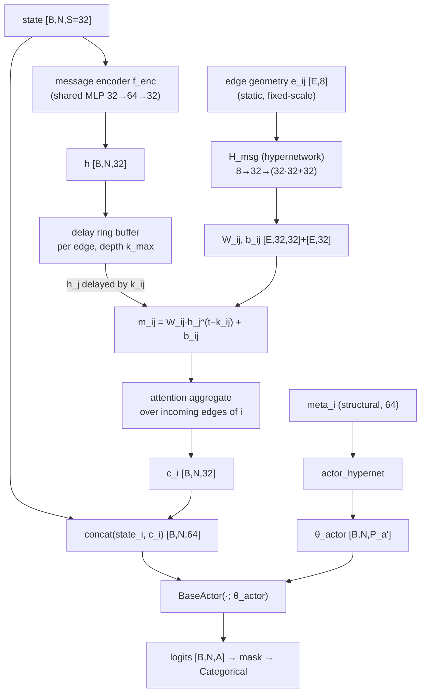
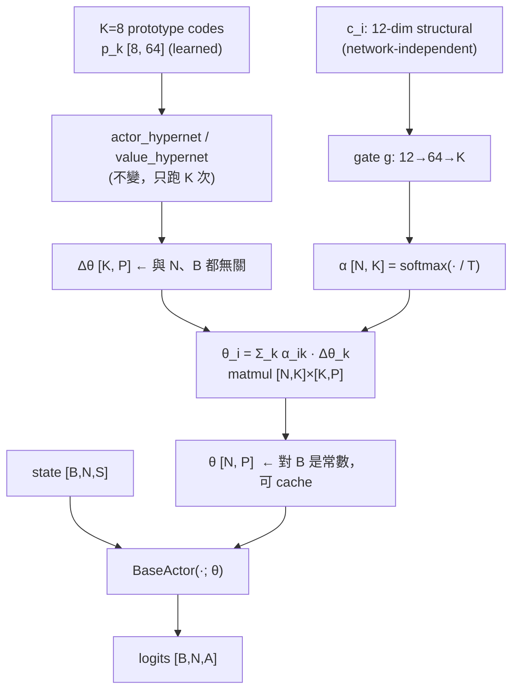

# 下一代架構提案：三個尚未被本研究證偽的 Hypernetwork 方向

> 產生日期：2026-09-02
> 基礎：`agent/hyperlight_ppo.py`（`hyperlight_mappo`）+ `configs/tsc/hyperlight_ppo.yml`
> 依據文件：`PROGRESS.md` §6（a)–(t)、`docs/RESULTS_CONDITIONING.md`、
> `docs/HYPERNETWORK_COMPRESSION_METHODS.md`、`transfer/TRANSFER.md`、`dynamic/DYNAMIC.md`、
> `external/unicorn_port/README.md`
>
> 這份文件的前半（§1–§3）是盤點，不含新主張，全部可回溯到既有實驗紀錄。
> 後半（§4–§7）是提案。

---

## 0. 一句話

**條件化（conditioning）這條軸已經走到底了**——內容值多少取決於路網，而且在多數路網上是零；
真正還沒被碰過、而且被本研究自己的數據指向的三個方向是：
**(A) 把生成目標從「節點」換成「邊」**、
**(B) 把狀態條件化從 policy 移到 credit assignment**、
**(C) 把每路口一套權重換成 K 個原型的混合**。

---

## 1. Baseline 盤點（維度與資料流）

### 1.1 目前主線

```
agent/hyperlight_ppo.py
  @Registry.register_model('hyperlight_ppo')    centralized_critic: False
  @Registry.register_model('hyperlight_mappo')  centralized_critic: True, mode=pooled
```

`agent/hyperlight.py`（TD3 + surrogate dynamics）與 `agent/hyperlight_td3.py` 已 parked，
不在結論裡。`agent/native_ppo.py`（`mappo`）是乾淨對照組：reward、obs 正規化、PPO 超參、
250 ep 預算、pooled critic 全部逐行相同，**唯一差別是權重共用還是逐路口生成**
（`PROGRESS.md` (o-2)）。

### 1.2 維度（以 `cityflow4x4` 為例，數字與 checkpoint 對得起來）

| 符號 | 意義 | 4x4 | 16x3 | 7x28 | Ingolstadt21 |
|---|---|---:|---:|---:|---:|
| `N` | 受控路口數 | 16 | 48 | 196 | 21 |
| `O` | padded lane 特徵寬（2 features × max in-lane） | 24 | 24 | 24 | 28 |
| `A` | max phase 數 | 8 | 8 | 8 | 4 |
| `S` | local state = `O + A` | **32** | 32 | 32 | 32 |
| `d_meta` | `agent_embedding_dim` | **64** | 64 | 64 | 64 |

資料流（`_policy_value()`）：

```
state_tensor [B, N, S]
      │
      ├─► _agent_meta()  ──►  meta [B, N, 64]      (learned | structural | constmeta …)
      │                          │
      │                          ├─► actor_hypernet ──► θ_actor [B, N, P_a]
      │                          └─► value_hypernet ──► θ_value [B, N, P_v]
      │
      ├─► _actor_forward(state, θ_actor)  ──► logits [B, N, A]  ──► mask ──► Categorical
      └─► _value_input(state)  ──► [B, N, 5S] ──► _generated_value_forward ──► V [B, N, 1]
```

`_value_input` 的 `pooled` 模式（`hyperlight_ppo.py:2531`）是
`concat(state_i, mean, std, max, min)` = `5S = 160`。

### 1.3 生成目標與參數量（實測，與 `HYPERNETWORK_COMPRESSION_METHODS.md` §6 一致）

BaseActor（`agent/actor.py`）：`S(32) → 64 → 64 → A(8)`

```
P_a = 32·64+64 + 64·64+64 + 64·8+8 = 6,792
actor_hypernet = 64·64+64 + 64·6,792+6,792 = 445,640   ✓ 與 checkpoint 相符
```

Value（pooled centralized）：`5S(160) → 128 → 64 → 1`

```
P_v = 160·128+128 + 128·64+64 + 64·1+1 = 28,929
value_hypernet = 64·64+64 + 64·28,929+28,929 = 1,884,545  ✓ 與 checkpoint 相符
合計 2,330,185
```

### 1.4 一個關鍵的計算事實（後面 §4.3 會用到）

hypernetwork 的 hidden 寬度 `h = 64`。生成一個目標參數要 `h` 次 MAC，**用**它只要 1 次：

| 每個 agent、每次 forward | 生成 (MACs) | 套用 (MACs) | 比值 |
|---|---:|---:|---:|
| actor | 438,784 | 6,656 | **65.9×** |
| value | 1,855,552 | 28,736 | **64.6×** |

**目前架構有 98.5% 的算力花在生成一組只用一次的權重上。**
這正是 `value_chunk_size: 16` 存在的原因，也是 chunked 推論延遲 +70~98%
（`HYPERNETWORK_COMPRESSION_METHODS.md` §8.3）的來源。

---

## 2. 已被證偽的設計空間（不要重複提）

這一節是這份提案最重要的護欄。每一條都有數字。

| # | 已證偽的主張 | 證據 | 出處 |
|---|---|---|---|
| F1 | 「更強的條件化訊號會更好」 | 4x4：`learned`(314.94) 打不贏幾乎是常數的 `structural`(314.28)；`constmeta`(224.52) 打平 12 維契約(226.67) | (a), (l) |
| F2 | 「結構特徵的內容有普遍價值」 | `cityflow4x4_hetero`：`learned` 281.24 < `constmeta` 282.94 < `struct` 283.38，**方向是反的**；`atlanta_1x5` 與 `shrink=0` 同結論 | (t-3), unicorn README |
| F3 | 「hypernetwork 參數化本身總是加分」 | Ingolstadt21：`constmeta`(324.70) 比**完全沒有 hypernetwork** 的 `mappo`(263.00) 還差 **61.7 秒** | (q) |
| F4 | 「把車流狀態餵進 meta 會更適應環境」 | 7x28 惡化 110 秒且 seed 不重疊；train loss 更低但 reward 更差 → 穩定收斂到更差的解 | (h) |
| F5 | 「有界調變（FiLM）是安全的特化方式」 | ±10% 夾限比「把 ID 直接 concat 到輸入」還弱；16x3 上 3 seeds 有 1 個跑飛（568.0 ± 565.5） | 壓縮文件 §9.1–9.2 |
| F6 | 「觀測 capacity 正規化可以當預設」 | 16x3 大勝（早 75–100 ep、變異小 23 倍），Ingolstadt21 **方向相反**（tail10 +17.4）；容量全距 33 倍時 `clip 1.5` 把短車道壓成常數 | (p) |
| F7 | 「單網最好的架構就是最會遷移的架構」 | `phstruct` 在來源網贏 29 秒，搬到 cologne3 輸 `mestruct` 65 秒 | (t-2) |
| F8 | 「rank 塌掉造成 chunked 不穩」 | `rf_init` **同時**讓 rank 更低（59.1→13.4）又讓結果更穩（std 75.24→31.47），因果被打臉 | (j), `CHUNK_SIZE_AND_EMBED_DIM.md` §7.4 |

另外三件不是「證偽」但同樣是硬約束：

- **F9 混淆未破解**：所有 null 在 CityFlow 合成格網，所有 win 在 SUMO 真實路網。
  異質性與模擬器在現有資料裡完全對齊（(t-3)）。任何新結果都必須同時在
  `cityflow4x4_hetero`（CityFlow + 異質）與 `sumo1x21`（SUMO + 異質）上報。
- **F10 完成率偏誤**：travel time / queue / delay 三個指標在「網路裡車比較少」時會一起下降，
  而 `phstruct` 的完成率低 2.5 個百分點（多/少 108 台車）。
  **任何 travel time 的比較都必須同時報 throughput 與完成率**（(s-2), (t-1)）。
- **F11 跨機器不可比**：同一張表的所有格子必須在同一台、未被搶占的機器上跑完
  （`RESULTS_CONDITIONING.md` §1）。續跑會打斷 RNG 流（§6.4 第 4 點）。

### 2.1 從證偽表反推出來的正面訊號

三件事在資料裡是站得住的，而且它們共同指向同一個方向：

1. **結構感知的「架構」比結構感知的「條件化」值錢。**
   排列不變的 phase head（`phstruct`）是整個研究最穩的一組 run
   （`last` sd **1.11** vs `struct` 的 6.26），而它同時把條件化的邊際價值壓到六分之一
   （54.2 秒 → 9.0 秒）。正確的表述是 (s-4) 說的：
   **actor 越是自己拿得到結構資訊，額外餵它結構向量的邊際價值越低。**
2. **贏的是「沒有逐路口索引表」，不是「結構特徵的內容」**（unicorn port 的立論）。
3. **移除「先建構再丟棄」會贏。** movement encoder 單獨開是有害的（`mestruct` 246.59），
   接上直接消費 movement token 的 phase head 就變成最好（`phstruct` 217.41）——
   因為舊 head 把 movement 層級的 token pool 掉才輸出固定寬度 logit（(s-1)）。

---

## 3. 核心痛點

| # | 痛點 | 具體證據 | 為什麼現有旋鈕解不掉 |
|---|---|---|---|
| **P1** | **actor 完全沒有協同機制** | actor 只吃 local state；唯一的「全域」是 critic 的 pooled mean/std/max/min。CoLight 的注意力在真實路網上**惰性**：sumo1x21 得到 21 節點 2 條邊、19 個節點度數 0（(m) 第 3 點） | conditioning 是**靜態的、逐節點的**，不管餵什麼都無法表達「i 現在要不要為 j 讓路」 |
| **P2** | **credit assignment 完全缺席** | `reward_i = −mean(queue_i)`，per-agent advantage 也是 local。壅塞網（7x28，queue ~14）上所有方法都在 1230–1400 秒，且是唯一「動態條件化有害」的地方 | pooled critic 只是 4 個統計量；沒有任何機制把「我放行造成下游溢出」算到我頭上 |
| **P3** | **權重生成的算力 98.5% 是浪費** | §1.4：生成比套用貴 65×；這是 chunked 推論 +98% 與 `value_chunk_size` 存在的原因 | chunked 省的是**參數**不是**算力**（延遲反而 +70~98%） |
| **P4** | **條件化的 cardinality 只試過兩個極端** | `learned` = N 個自由 code（不能遷移）；`constmeta` = 1 個常數 code（比不用 hypernet 還差）。**1 < K < N 從來沒有試過** | (q) 對 `constmeta` 的診斷正是「逐路口生成同一份權重＝高度冗餘的參數化」——這句話直接指向 K |
| **P5** | **狀態條件化的失效機制已診斷，但修法沒試** | (h)：EMA 持續漂 → 生成權重跟著漂 → policy 追移動目標。但書自己寫了：只試過 `dynamic_scale=1.0` 且無上界，注入點只有 meta 一處，同時影響 actor 與 critic | 壓小 scale 只會從「有害」回到「無效」（F5 的教訓）；需要換**注入位置**與**離散化**，不是換幅度 |

---

## 4. 方案 A：Relational Hypernetwork — 生成「邊」的訊息函數，而不是「節點」的權重

> 對應使用者需求的 **Hypernetwork-driven Communication / Coordination**。
> 針對痛點 **P1**。

### 4.1 核心創新點與論文啟發

**一句話**：把 hypernetwork 的生成目標從 `θ_i = H(code_i)`（節點）換成
`W_ij = H(e_ij)`（邊），其中 `e_ij` 是**與路網無關的邊幾何**，
而車流的動態資訊走**訊息內容**（輸入）而不是權重。

三個靈感來源：

1. **CoLight (Wei et al., CIKM 2019) / GAT** 的鄰居注意力——但本研究已經量出它在真實路網上
   **惰性**（(m)：19/21 個路口只注意自己）。所以不是照抄注意力，而是先修圖：
   用 contracted adjacency（`cb11891`，已在格狀網上逐一驗證為恆等變換）把無號誌路口收縮掉。
2. **HyperMARL / hypernetwork-generated message functions**：既然 hypernetwork 的價值被證明
   來自「不是索引表的參數化」（unicorn port 的立論），那它最該生成的是**關係**——
   關係在同質格網上仍然有變異（連接路段的長度、車道數、轉向比例都不同），
   而節點在同質格網上沒有變異（12 in-lane、8 phase 完全一樣，這正是 F1/F2 的成因）。
3. **交通工程的 offset 理論**：兩個號誌之間的耦合強度由**連接路段的自由流走行時間 τ_ij**
   決定（綠波帶的物理）。這是 TSC 獨有、而且純 MARL 文獻不會有的歸納偏差。

**這個方案為什麼繞得開 F1/F2/F4**：

- 繞開 F1/F2（內容值零）：因為 `e_ij` 在**同質格網上仍有變異**。
  4x4 的 16 個路口結構相同（CV=0），但它的 24 條邊在長度上是有分佈的。
  條件化的內容第一次被放在一個「內容真的存在」的物件上。
- 繞開 F4（狀態條件化有害）：(h) 的失效機制是「慢速 EMA 進了**權重**」。
  這裡的分工是嚴格相反的——
  **靜態幾何 → 權重（不漂）；動態車流 → 訊息內容（輸入，本來就該每步變）**。
  這才是 `DYNAMIC.md` §0 想做的 fast/slow 分解，只是當初做反了。

**真正新的一點：延遲感知的訊息（delay-aware messaging）。**
上游路口 j 現在放行的車隊，要 `τ_ij` 秒後才會到 i。目前所有 TSC 的 GNN 方法（含 CoLight）
都當作訊息瞬間到達。這裡讓訊息延遲 `k_ij = round(τ_ij / action_interval)` 個決策步才被消費。
`action_interval=10` 秒、都市路段 200–400 m @ 13.9 m/s ⇒ `k_ij ∈ [1, 3]`，`k_max ≈ 6`。

### 4.2 架構詳細設計



**模組劃分**

| 模組 | 輸入 | 輸出 | 是否新增 |
|---|---|---|---|
| `f_enc` 訊息編碼器（共用） | `state_i` (32) | `h_i` (32) | 新增 |
| `H_msg` 邊 hypernetwork | `e_ij` (8) | `W_ij` (32×32), `b_ij` (32) | **新增，本方案核心** |
| delay ring buffer | `h` 歷史 | `h_j^(t−k_ij)` | 新增（非參數） |
| 聚合注意力 | `{m_ij}` | `c_i` (32) | 新增 |
| actor hypernetwork | `meta_i` (64) | `θ_actor` | 沿用，輸入寬 32→64 |
| critic | 不動 | 不動 | 沿用 |

**邊幾何契約 `e_ij`（8 維，固定尺度正規化，與 `transfer/structural.py` 同一套哲學）**

| # | 特徵 | 固定尺度 | 為什麼可遷移 |
|---:|---|---:|---|
| 1 | 自由流走行時間 `τ_ij` | 60 s | 秒是絕對單位 |
| 2 | 連接路段長度 | 500 m | 公尺是絕對單位 |
| 3 | 連接路段車道數 | 6 | 車道數是絕對計數 |
| 4 | 速限 | 20 m/s | 絕對單位 |
| 5 | i→j 的 movement 佔 i 全部 movement 的比例 | 1.0 | 本來就是比例 |
| 6 | 收縮掉的無號誌路口數 | 4 | 絕對計數 |
| 7 | j 的 in-degree 倒數（j 有多少上游競爭者） | 1.0 | 比例 |
| 8 | 是否為主要轉向（直行=1，左右轉<1） | 1.0 | 比例 |

**所有 8 維都不含路網識別、不含路口編號、不含 N**——所以整組 `H_msg` 權重可以跨路網搬。
這比目前的 `structural` 契約更乾淨：它連「節點在這張網裡的位置」都不需要。
沿用 `spec_id()` 機制標記（`edge_v1:`），避免契約不同的 checkpoint 互載。

**生成目標與維度**

```
d_h = 32 (訊息內容維度)     d_m = 32 (訊息維度)     d_e = 8
P_msg = d_m·d_h + d_m = 32·32 + 32 = 1,056        每條邊的目標參數
H_msg = 8·32+32 + 32·1,056+1,056 = 288 + 34,848 = 35,136 參數
```

**注意 `H_msg` 的參數量與 E（邊數）和 N 都無關**——跟目前 hypernetwork 的性質一致。

**圖從哪裡來**：**必須用 contracted adjacency**，不能用 `_build_directed_graph_edges()`
現在走的原始 world adjacency——(m) 已經量出後者在 sumo1x21 上是 21 節點 2 條邊。
`transfer/structural.py` 的 `_neighbour_sets()`（「i 的出路是 j 的入路」）是正確的來源，
`--colight_adjacency contracted`（`cb11891`）已經把收縮邏輯寫好且驗證過。

### 4.3 訓練機制與梯度流

**損失函數：完全不動 PPO。**

```
loss = policy_loss + value_coef · value_loss − entropy_coef · entropy
```

`H_msg`、`f_enc`、聚合注意力全部只透過 `policy_loss` 收梯度（它們只在 actor 路徑上）。
**不新增任何 auxiliary loss**——本專案的紀律是不加論文/官方 repo 沒有的 loss
（`HYPERLIGHT_PPO_MAPPO_ARCHITECTURE.md` §1 第 6 點）。

**⚠️ 最容易踩、而且不會報錯的坑：PPO 的 log-prob 一致性。**
這正是 `DYNAMIC.md` §3 記下來的陷阱，而延遲訊息讓它更嚴重：
`c_i^t` 依賴 `k_ij` 步之前的 `h_j`，PPO 更新時**必須重現 rollout 當下收到的那組訊息**，
否則 ratio 是錯的而且訓練看起來一切正常。

**處理方式（比 `DYNAMIC.md` 的 commit-once 更嚴格）**：
把 `c_i^t`（`[T, N, 32]`，float32 下 7x28 一個 rollout 是 360·196·32·4B ≈ 9.0 MB）
**直接存進 rollout buffer**，更新時讀存下來的值，不重算 ring buffer。
代價是記憶體，換到的是「梯度流可驗證」。
（若要讓 `H_msg` 也收到 `c` 的梯度，則存 `h`（同樣大小）並在更新時重跑聚合，
但 ring buffer 的索引必須跟著存——建議第一版存 `c` 並讓 `H_msg` 只透過當步邊收梯度。）

**穩定訓練技巧**

| 技巧 | 為什麼 | 本 repo 的先例 |
|---|---|---|
| **聚合輸出層零初始化** | 讓 `c_i ≡ 0`，第 0 步與 baseline 逐位元相同 | `_zero_last_linear`（`hyperlight_ppo.py:1462`），`DYNAMIC.md` §2 已用此法驗證 4x4 travel time 1592.0815 完全重現 |
| **`H_msg` 輸出頭用 fan-in 校準的正交初始化** | `W_ij` 是被生成的 32×32 矩陣，預設 init 會讓它的 spectral norm 隨 `d_h` 漂 | `hyper_rf_init` 的 `per_chunk` 模式已經做過這件事（(j)），且 (g)/(j) 顯示 rf **治變異**（16x3 ±4.00→±1.24） |
| **對 `W_ij` 做 spectral normalization（上界 1.0）** | 訊息在圖上會被反覆聚合；`‖W_ij‖₂ > 1` 會讓多跳訊息指數放大。這是 F4 那種「權重漂」的圖上版本 | 本 repo 沒試過，是新增的防護 |
| **注意力 logit 不 clip，但溫度固定** | `cos_logit_clip` 的存在說明過去踩過，但 clip 是 F5 那類「有界」補丁 | — |
| `grad_clip: 0.5` 沿用 | — | 現行設定 |

**為什麼不需要擔心 F4 的「追移動目標」**：`W_ij` 只由**靜態幾何**生成，
在整個訓練期間對固定路網是**常數張量**（可以 cache，見 §4.4）。
會變的只有 `h_j`，而那是輸入——actor 本來就每 10 秒吃一次會變的輸入。

### 4.4 優缺點評估與消融實驗

**計算開銷（7x28，N=196，E ≈ 4·196 ≈ 780 條收縮後的有向邊）**

| 項目 | Baseline | 方案 A | 差 |
|---|---:|---:|---|
| hypernetwork 參數 | 2,330,185 | 2,504,733 | **+7.5%** |
| ├ `H_msg` | — | 35,136 | 新增 |
| ├ `f_enc` + 聚合 | — | ~6,300 | 新增 |
| └ actor hypernet（輸入 32→64，`P_a` 6,792→8,840） | 445,640 | 578,760 | +133,120 |
| 每步 MACs：訊息路徑 | — | E·d_m·d_h = 780·1,024 ≈ **0.80 M** | 相對 449.7 M 可忽略 |
| 每步 MACs：`W_ij` 生成 | — | **0（可 cache）** | 靜態幾何 ⇒ 每個 episode 算一次 |
| rollout buffer | — | +9.0 MB（存 `c`） | 新增 |
| delay ring buffer | — | 780·6·32·4B ≈ 0.6 MB | 可忽略 |

**核心優點**：新增的算力 < 0.2%，參數 +7.5%，卻是第一次讓 actor 有協同能力。
**風險**：(m) 的教訓是真實路網的圖很稀疏——如果收縮後 sumo1x21 仍然只有少數邊，
訊息路徑會退化成 no-op（這不是災難，是 null，而且**便宜就能先驗證**，見下面的 kill test）。

### 4.4.1 Kill test 結果（2026-09-02）——**方案 A 未通過，不建置**

`scripts/edge_contract_stats.py`，純靜態分析（不開模擬器、不用 torch）。
邊集合與 `common/utils.py` 的 `contract_uncontrolled` 逐對相符（`chk=ok`），
所以量到的是本 repo 真正在用的那張圖。

未加距離上限（即 repo 現行的收縮定義）：

| 路網 | 節點 | 邊 | 平均入度 | 度數 0 | **CV(τ)** | τ 平均 | 平均跳數 | 判定 |
|---|---:|---:|---:|---:|---:|---:|---:|---|
| cityflow4x4 | 16 | 48 | 3.00 | 0 | 0.143 | 63.0 s | 1.00 | fail |
| cityflow4x4_hetero | 16 | 44 | 2.75 | 0 | 0.143 | 63.0 s | 1.00 | fail |
| cityflow16x3 | 48 | 154 | 3.21 | 0 | **0.604** | 18.4 s | 1.00 | **PASS** |
| cityflow7x28 | 196 | 714 | 3.64 | 0 | **0.000** | 27.0 s | 1.00 | fail |
| sumo1x21 | 21 | 143 | 6.81 | 6 | **1.207** | 318.8 s | **19.89** | PASS\* |
| sumo_cologne3 | 3 | 4 | 1.33 | 0 | 0.068 | 19.0 s | 4.00 | fail |
| sumo_atlanta1x5 | 5 | 8 | 1.60 | 0 | 0.139 | 10.9 s | 1.00 | fail |

\* sumo1x21 的 PASS 是假的：平均跳數 **19.89**、平均長度 1520 m、τ 平均 **318.8 秒**——
這些「邊」是穿越整個城市的路徑，不是相鄰號誌之間的耦合。加上距離上限之後圖就散掉：

| sumo1x21 | 邊 | 平均入度 | 度數 0 | CV(τ) | τ 平均 | 平均跳數 |
|---|---:|---:|---:|---:|---:|---:|
| 無上限 | 143 | 6.81 | 6 | 1.207 | 318.8 s | 19.89 |
| ≤ 800 m | 37 | **1.76** | 6 | 0.586 | 34.8 s | 6.86 |
| ≤ 400 m | 15 | **0.71** | 9 | 0.487 | 16.8 s | 5.07 |

**沒有任何一個上限能同時讓 Ingolstadt21 有可用的度數、又讓「邊」真的代表相鄰。**

**結論：方案 A 的核心前提被自己的資料推翻。**

> 「邊在同質格網上有變異，而節點沒有」——**這句話是錯的。**
> `cityflow7x28` 的 **CV(τ) 恰好等於 0.000**（全網每條邊都是 300 m），
> 所以在 7x28 上「用邊幾何生成訊息函數」在數學上**就是** `constmeta`；
> 而 (q) 已經證明沒有內容的 hypernetwork 比完全不用 hypernetwork 更差。
> 4x4 / 4x4_hetero 的 0.143 也不足以撐起任何主張。
> 唯一真正有變異的 `sumo1x21`，在任何有物理意義的耦合半徑下都沒有可用的圖。

這是 F1／F2 在高一層的複製：**條件化的內容在同質網上值零，換成邊之後仍然值零。**

延遲機制（原本最新穎的 A4）也一起失效：7x28 的 τ 全網固定 27.0 秒 ⇒ 每條邊 `k_ij` 都是 3，
4x4 固定 63 秒 ⇒ 每條邊都是 6。**常數延遲不是機制，是一個固定的 lag。**

**沒有被這個測試否定的部分**（誠實界定範圍）：沿著邊傳遞**動態車流狀態**這件事本身沒有被測——
被否定的是「用邊幾何**生成**訊息函數的權重」。前者是普通的 GNN 通訊，不含 hypernetwork，
不在本文的提案範圍內；若要做，它是一個獨立的題目，而且要先面對 CoLight 在 (m) 已經踩過的坑。

<details>
<summary>原始 kill test 設計（保留備查）</summary>

**Kill test（跑任何訓練之前，30 分鐘內可完成）**

```
對 4x4 / 16x3 / 7x28 / sumo1x21 / cityflow4x4_hetero / cologne3 印出：
  收縮後的 (節點數, 邊數, 平均度數, 度數為 0 的節點比例)
  e_ij 8 個維度的 min/mean/max/CV
```

**通過條件**：平均度數 ≥ 2 且 `τ_ij` 的 CV ≥ 0.2（也就是「邊真的有變異」）。
**若 sumo1x21 收縮後仍然接近空圖，本方案在真實路網上直接作廢**——
而且這正是 F2 那條「內容值零」的結論會複製到邊上的情況。先量再做。

**消融配置**（未執行——方案 A 已在 §4.4.1 停止）

| # | Arm | 拿掉什麼 | 問的問題 |
|---|---|---|---|
| A0 | `struct`（現行） | 全部 | baseline |
| A1 | `edge_full` | — | 完整方案 |
| A2 | `edge_shared` | `H_msg` 換成一組共用的 `W`（不生成） | **生成邊權重值不值錢**（對應 F3 的邊版本） |
| A3 | `edge_const` | `e_ij` 換成常數向量 | **邊內容值不值錢**（對應 (q) 的 `constmeta`） |
| A4 | `edge_nodelay` | `k_ij ≡ 0` | **延遲機制值不值錢**（本方案最新穎的一點） |
| A5 | `edge_meanagg` | 注意力換成 mean | 聚合方式的貢獻 |

A2 與 A3 是**必做**的：它們是 (o-2)/(q) 那組拆解在邊上的複製，而那組拆解是本研究
最有價值的方法論產出。A4 單獨值得一篇的篇幅。

</details>

---

## 5. 方案 B：Regime-Quantized Hypernetwork on the Credit-Assignment Path

> 對應使用者需求的 **Dynamic Weight Generation**（但注入點是 critic 不是 actor）。
> 針對痛點 **P2** 與 **P5**。

### 5.1 核心創新點與論文啟發

**一句話**：狀態條件化不是錯的方向，是**注入錯了位置**。
把它從 actor 的權重移到 **credit assignment**，並且**離散化**成 K 個 regime 原型，
讓生成的權重是分段常數而不是連續漂移。

**靈感來源**

1. **QMIX (Rashid et al., ICML 2018 / JMLR 2020)**——MARL 裡最成功、也最早的 hypernetwork
   應用：mixing network 的權重由全域狀態 `s_t` 生成，並用 `|W|` 保證單調性（IGM）。
   **本專案從來沒有用過 value factorization**，而它正是 hypernetwork 在 MARL 的原生用途。
2. **本研究自己的診斷 (h)**：`structdyn` 的 train loss 更低（0.0011 vs 0.0019）
   但 reward 更差（−288 vs −271）——**沒有 NaN、沒有發散，是穩定收斂到更差的解**。
   這是「policy 追移動目標」的簽名，不是最佳化失敗。
   ⇒ 修法必須讓權重**停止連續移動**，而不是讓它移動得小一點（後者是 F5 已經否定的路）。
3. **VQ-VAE 的 straight-through 量化**：把連續 regime code 投影到 K 個學到的原型上。
   權重因此在 regime 沒切換時**逐位元不變**。

**為什麼繞得開 F4**：F4 的三個成因，這裡逐條拆掉——

| (h) 的失效條件 | 方案 B |
|---|---|
| 注入點在 `meta`，同時影響 actor 與 critic | **只影響 mixer**，actor 的權重完全不碰 |
| `dynamic_scale=1.0` 且無上界，encoder 可把調變學到任意大 | 單調性約束 `|W|` + K 個原型 ⇒ 生成權重落在 K 個點的凸包內 |
| EMA 連續漂移 ⇒ 權重連續漂移 | **量化 ⇒ 分段常數**；regime 不切換時權重完全不動 |

而且 P2 說的痛點正好在 7x28——F4 唯一「有害」的那張網，也是 credit assignment 最需要的那張網。

### 5.2 架構詳細設計

**⚠️ 對 vanilla QMIX 的一個必要修正**：QMIX 的 mixer 生成 `W1 ∈ R^{N×d}`，
形狀依賴 N ⇒ 不能跨路網搬，會踩到本 repo 花了整個 B4 才解決的問題。
這裡改成**排列等變的 mixer**：同一個生成出來的純量權重函數套用到每個 agent 上。

```mermaid
flowchart TD
    S["state [B,N,S]"] --> GS["global summary<br/>concat(mean,std,max,min) [B,4S=128]"]
    GS --> RE["regime encoder<br/>128→64→32"]
    RE --> ZC["z_cont [B,32]"]
    ZC --> VQ["quantize: nearest of<br/>K=8 prototypes (straight-through)"]
    VQ --> Z["z_t [B,32]  (piecewise constant)"]

    Z --> HW["H_w: (32+12)→64→1<br/>per-agent mixing weight"]
    CI["c_i = structural feat [N,12]"] --> HW
    HW --> W["w_i = |·| + eps   [B,N,1]"]

    Z --> HB["H_b: 32→64→1"]
    HB --> BIAS["V_bias [B,1]"]

    S --> VN["shared value net<br/>(local input, NOT pooled)"]
    VN --> VI["V_i [B,N,1]"]

    VI --> MIX["V_tot = sum_i w_i · V_i + V_bias"]
    W --> MIX
    BIAS --> MIX
    MIX --> VTOT["V_tot [B,1]"]
```



**生成目標與維度**

```
K = 8 regime 原型，d_z = 32
regime encoder : 4S(128)→64→32          = 128·64+64 + 64·32+32 =  8,256 + 2,080 = 10,336
codebook       : K·d_z = 8·32           = 256
H_w            : (32+12)→64→1           = 44·64+64 + 64·1+1     = 2,880 + 65 = 2,945
H_b            : 32→64→1                = 32·64+64 + 64·1+1     = 2,112 + 65 = 2,177
                                                          合計    ≈ 15,714 參數（+0.67%）
```

**value 網路的改動**：`centralized_critic_mode` 從 `pooled` 改回 **local**
（`V_i` 只吃 `state_i`）——全域資訊改由 mixer 的 `w_i(z_t)` 承載。
這讓 `P_v` 從 28,929 掉到 `32·128+128 + 128·64+64 + 64·1+1 = 12,545`，
value hypernetwork 因此從 1,884,545 掉到 **819,585**（−56.5%）。
**方案 B 整體是省參數的**（2,330,185 → 1,280,939，−45.0%）。

### 5.3 訓練機制與梯度流

**損失函數**

```
# 1. 全域 value（取代原本的 per-agent value loss）
V_tot = Σ_i w_i(z_t, c_i) · V_i(s_i) + V_bias(z_t)
R_tot = GAE return 由全域 reward r_tot = Σ_i r_i 算出
value_loss = max( (V_tot − R_tot)²,  (V_tot_clipped − R_tot)² )        # 沿用 clip_vf

# 2. per-agent advantage 由 mixer 分配（這是 credit assignment）
A_i = (∂V_tot / ∂V_i) · A_tot = w_i(z_t, c_i) · A_tot                  # 解析解，不需 autograd
policy_loss = −mean_i min( ratio_i · A_i, clip(ratio_i, 1±ε) · A_i )

# 3. VQ commitment（唯一新增的 loss，係數固定不掃）
vq_loss = ‖sg[z_q] − z_cont‖² + β·‖z_q − sg[z_cont]‖²,   β = 0.25

loss = policy_loss + value_coef·value_loss + vq_coef·vq_loss − entropy_coef·entropy
```

`A_i = w_i · A_tot` 是這個設計最漂亮的地方：**單調 mixer 的梯度就是 credit 權重**，
不需要額外的 credit assignment 機制，也不需要 autograd 拿二階量。
`w_i > 0`（由 `|·|` 保證）⇒ 不會有 agent 的 advantage 被反號 ⇒ IGM 成立。

**穩定訓練技巧**

| 技巧 | 為什麼 |
|---|---|
| **`H_w` 輸出頭零初始化 + 常數偏置 1/N** | 讓 `w_i ≡ 1/N`，`V_tot = mean_i V_i`，`A_i = A_tot/N`——**開局在數值上退化成現行的均勻 credit**。這是 `_zero_last_linear` 紀律的延伸，讓「開 vs 關」的第 0 步可比 |
| **`w_i` 加 `eps=1e-3` 下界** | 避免某個 agent 的 advantage 被完全歸零而停止學習 |
| **codebook EMA 更新 + dead-code re-init** | K=8 很容易塌成 1–2 個活躍原型；塌了就退化成 `constmeta`（而 (q) 已證明那比不用還差） |
| **`vq_coef` 從 0 線性升溫到 0.25（前 20 ep）** | 早期 regime encoder 還沒學到東西時不要硬把它拉向隨機原型 |
| **regime encoder 的輸入不做 EMA** | (h) 的漂移來自 EMA；這裡直接吃當步全域統計量，由**量化**提供時間穩定性，不由平滑提供 |
| spectral norm | 不需要——`|·|` 與 K 個原型的凸包已經給了上界 |

**必須監控的診斷量**（不監控就等於沒做）：
`活躍原型數`、`regime 切換頻率（每 episode）`、`w_i 的 min/max/entropy`、
`V_tot 與 Σr_i 的相關係數`。
若「活躍原型數 = 1」，本方案就是 `constmeta`，直接停。

### 5.4 優缺點評估與消融實驗

**開銷比較（7x28）**

| 項目 | Baseline | 方案 B | 差 |
|---|---:|---:|---|
| 總 hypernetwork 參數 | 2,330,185 | **1,280,939** | **−45.0%** |
| value 生成 MACs / agent / forward | 1,855,552 | 806,976 | −56.5% |
| mixer 額外 MACs（N=196 全網一次） | — | ~0.58 M | 相對 449.7 M 可忽略 |
| `value_chunk_size` 的必要性 | 需要 | 大幅降低 | — |

**核心優點**：這是三個方案裡唯一**同時省參數、省算力、又補上缺失機制**的。
**風險**：改動了 PPO 的 advantage 定義 ⇒ 與所有既有數字不再是同一個目標函數。
必須把 `w_i ≡ 1/N` 的退化 arm 跑出來，證明它重現現行 baseline，否則無法歸因。

**消融配置**

| # | Arm | 設定 | 問的問題 |
|---|---|---|---|
| B0 | `mappo`（現行 pooled） | — | baseline |
| B1 | `mix_uniform` | `w_i ≡ 1/N` 固定 | **必做的健全性檢查**：應該重現 B0 |
| B2 | `mix_full` | K=8 量化 regime | 完整方案 |
| B3 | `mix_cont` | 不量化，直接用 `z_cont` | **量化是不是必要的**（直接檢驗 (h) 的診斷） |
| B4 | `mix_static` | `z_t` 換成常數 | regime 內容值不值錢 |
| B5 | `K ∈ {2, 4, 8, 16}` | — | cardinality 掃描 |

**B3 是本方案最重要的一格**：如果 `mix_cont` 也贏，那 (h) 的「漂移」診斷就是錯的，
真正的問題是注入位置（actor vs critic）；如果 `mix_cont` 輸而 `mix_full` 贏，
診斷成立且量化是解法。**兩種結果都有價值**，這是一個設計良好的實驗。

**優先跑 7x28 與 sumo1x21**——前者是 P2 最痛的地方，後者是唯一 hypernetwork 有效的路網。

---

## 6. 方案 C：Hierarchical K-Prototype Factorized Hypernetwork

> 對應使用者需求的 **Hierarchical / Factorized Hypernet**。
> 針對痛點 **P3** 與 **P4**。

### 6.1 核心創新點與論文啟發

**一句話**：條件化的 cardinality 只試過 `N`（`learned`，不能遷移）與 `1`（`constmeta`，
比不用 hypernet 還差）。**`1 < K < N` 從來沒有試過**，而本研究自己的診斷直接指向它。

(q) 對 `constmeta` 失效的解釋是：

> 「逐路口生成同一份權重，等於用一個**高度冗餘的參數化**去表達一個共用策略。」

而 `learned` 的失效是索引表不能遷移。**K 個原型的軟混合恰好是這兩者之間唯一的物件**：
它不是索引表（可遷移），也不冗餘（K 個真正不同的權重集合）。

```
θ_i = Σ_{k=1..K} α_ik · Δθ_k ,   α_i = softmax(g(c_i) / T) ∈ Δ^{K-1}
Δθ_k = H(p_k)   ← hypernetwork 只跑 K 次，與 N 無關
```

**靈感來源**

1. **RegionLight（本 repo 參考文獻之一）/ 區域化 TSC**：路口在功能上分成少數幾類角色
   （幹道直行、幹道-支線交會、邊界進入口、內部平衡點），而不是 N 個獨立個體。
2. **Mixture-of-Experts / 條件式計算**：`α_i` 是 gating，`Δθ_k` 是 expert 的權重。
   差別在 expert 的**權重本身是生成的**，所以 expert 數量與參數量解耦。
3. **本研究的 (j)/§7.4 觀察**：`rf_init` **同時**把 effective rank 從 59.1 壓到 13.4
   **又**把 std 從 ±75.24 壓到 ±31.47。文件自己寫下的反向解讀是
   「低秩初始化本身就是一種正則化」。**K-原型混合就是把秩上限顯式設成 K 的參數化**——
   這是本 repo 唯一一個「被自己的數據暗示、但沒被做過」的方向。

### 6.2 架構詳細設計



**維度**

```
K = 8,  d_p = 64（與現行 d_meta 相同，所以 hypernetwork 完全不用改）
prototype codes : K·64                        = 512
gate            : 12→64→8 = 12·64+64 + 64·8+8 = 832 + 520 = 1,352
actor_hypernet  : 445,640    （不變）
value_hypernet  : 1,884,545  （不變）
                                        合計  ≈ 2,332,049（+0.08%）
```

**方案 C 是純粹的 reparameterization——參數量幾乎不變，改變的是算力與歸納偏差。**

**`α_i` 從哪裡來（三個變體，對應不同風險）**

| 變體 | `c_i` | 可遷移 | 風險 |
|---|---|---|---|
| **C-struct**（預設） | 12 維結構契約 | ✅ | 無新風險 |
| C-geo | 結構 + 正規化座標 | ⚠️ 座標依賴路網 | 只能同網 ablation |
| C-role | 結構 + 行為 EMA（動作分佈、佇列輪廓） | ✅（EMA 定義與路網無關） | **踩 F4 的風險**——必須 stop-gradient + 每 N 個 episode 才更新一次 `α`，讓它分段常數 |

C-role 是最有可能贏、也最危險的一格。**建議先做 C-struct，C-role 當第二輪**。

### 6.3 訓練機制與梯度流

**損失函數：完全不動 PPO。** 沒有新增 loss。

梯度路徑：`policy_loss → θ_i → {Δθ_k, α_ik} → {p_k, gate}`。
`α_ik` 對 `Δθ_k` 的梯度是 `α_ik · ∂L/∂θ_i`，所以**用得多的原型學得快**——
這是 MoE 的經典塌陷風險。

**穩定訓練技巧**

| 技巧 | 為什麼 |
|---|---|
| **gate 溫度 `T` 從 2.0 退火到 0.5** | 早期讓所有原型都收到梯度（避免塌成 1 個），後期才特化。**T 是本方案唯一需要掃的新超參** |
| **原型使用率的負載平衡監控（不是 loss）** | Switch-Transformer 式的 load-balancing loss 會違反「不加額外 loss」的紀律；改成**監控 + 死原型重新初始化**（與方案 B 的 codebook 處理一致） |
| **`p_k` 用不同亂數種子正交初始化** | K 個原型若初始相近，`Δθ_k` 會一起塌 |
| **`hyper_rf_init` 的 `per_chunk` 模式建議同時開啟** | (j) 證明它治變異；而 K-混合本身是低秩，兩者的交互作用是 §6.4 的 C5 arm |
| **`α` 對 batch 是常數（C-struct）** | ⇒ `θ` 可以每個 PPO update 算一次而不是每個 minibatch，這是 §6.4 的算力來源 |

**與 F3 的關係（重要）**：(q) 證明「沒有內容的 hypernetwork 比沒有 hypernetwork 更差」。
方案 C 的 `K=1` **就是** `constmeta`，所以 C5 的 K 掃描裡 `K=1` 應該重現 (q) 的失敗。
**如果 `K=1` 沒有重現失敗，代表實作有問題**——這是一個內建的正確性檢查。

### 6.4 優缺點評估與消融實驗

**計算開銷（7x28，N=196，K=8）**

生成成本從 `N × (d·h + h·P)` 變成 `K × (d·h + h·P) + N·K·P`：

| 每次 forward（MACs） | Baseline (N=196) | 方案 C (K=8) | 比值 |
|---|---:|---:|---:|
| actor 生成 | 86.0 M | 3.5 M + 10.6 M = **14.1 M** | **6.1× 省** |
| value 生成 | 363.7 M | 14.8 M + 45.4 M = **60.2 M** | **6.0× 省** |
| 合計 | **449.7 M** | **74.3 M** | **6.1× 省** |

一般式：省下的倍率 ≈ `h / K = 64 / 8 = 8`（`N·K·P` 那一項讓實際值略低於 8）。

**記憶體**：`Δθ` 是 `[K, P]`，**與 B 和 N 都無關**。
`θ` 是 `[N, P]`（C-struct 下對 batch 是常數）= 196·6,792·4B ≈ 5.3 MB，
**不再需要 `value_chunk_size` 這種為了避開 `[B·N·P]` 尖峰而存在的工程補丁**。

**推論延遲**：chunked(c8) 的 +70~98% 延遲來自「推論時仍要跑生成器」。
方案 C 在 C-struct 下 `θ` 可以在部署前**離線算好並凍結**
⇒ 推論延遲等同一個普通 MLP，比 baseline 的 0.206–0.664 ms **更快**。
這一格是 `HYPERNETWORK_COMPRESSION_METHODS.md` §8.4 那張三方權衡表上
**目前沒有任何方法佔據的位置**（準確度 ≈ all_weights、參數 ≈ all_weights、延遲 < all_weights）。

**核心風險**：K-原型是一個秩上限為 K 的約束。若某張路網真的需要 N 個不同的策略，
C 會輸給 `learned`。但 F1/F2 已經強烈暗示不需要——
**`constmeta`（K=1）在 4x4 上就已經打平 12 維契約了**。

**消融配置**

| # | Arm | 設定 | 問的問題 |
|---|---|---|---|
| C0 | `struct` / `learned` | — | baseline（兩個都要，因為它們是 K=N 的兩種形式） |
| C1 | `proto_struct` | K=8, C-struct | 完整方案 |
| C2 | `K ∈ {1, 2, 4, 8, 16, 32}` | — | **cardinality 曲線——本方案的主結果**。`K=1` 必須重現 `constmeta` 的失敗 |
| C3 | `proto_random` | `α_i` 換成固定隨機 one-hot | **分群是不是有意義的**（vs 只是「有 K 個權重集合」） |
| C4 | `proto_role` | C-role 變體 | 行為分群 vs 結構分群 |
| C5 | `proto_struct + rf_per_chunk` | 疊上 (j) 的修法 | 低秩參數化與低秩初始化的交互作用 |

**C2 的 K 曲線是可以獨立成篇的結果**：把 `learned`(K=N)、`constmeta`(K=1)
與中間所有點畫在同一條軸上，等於把本研究前六個月的所有條件化結果放進一張圖。
**這是把一堆 null result 轉成一個正面貢獻的方式。**

`C3` 是必做的對照：如果隨機分群也一樣好，那贏的是「K 組權重」這個容量結構，
不是「結構相似的路口該共用策略」這個假設——兩種結論的論文寫法完全不同。

---

## 7. 三案比較與建議順序

### 7.1 對照表

| | 方案 A（Relational） | 方案 B（Regime Mixer） | 方案 C（K-Prototype） |
|---|---|---|---|
| 痛點 | P1 協同缺席 | P2 credit assignment、P5 | P3 算力浪費、P4 cardinality |
| Hypernet 生成目標 | **邊**的訊息函數 `W_ij` | **mixer** 的 credit 權重 `w_i` | K 個**原型**權重集合 `Δθ_k` |
| 條件化訊號 | 靜態邊幾何（8 維） | 量化全域 regime（K=8） | 結構原型混合（K=8） |
| 參數變化 | **+7.5%** | **−45.0%** | +0.08% |
| 算力變化 | +0.2% | −56%（value 側） | **−84%（6.1× 省）** |
| 推論延遲 | 略增 | 減少 | **減少（可離線凍結 θ）** |
| 實作量 | 大（ring buffer + buffer 擴充 + 圖收縮） | 中（PPO advantage 定義要改） | **小（不動 PPO、不動 hypernetwork 本體）** |
| 破壞既有可比性 | 否（零初始化可退化） | **是**（advantage 定義改變） | 否（`K=N` + one-hot α 退化成 `learned`） |
| 最大風險 | 收縮後的圖仍然太稀疏（(m) 的教訓） | mixer 塌成均勻 ⇒ 等於沒做 | 秩上限 K 不夠 |
| 有沒有便宜的 kill test | **有**（§4.4，30 分鐘，不用訓練） | 有（B1 健全性檢查） | 有（C2 的 `K=1` 必須重現已知失敗） |

### 7.2 建議順序

**第一步：方案 A 的 kill test（不需要訓練，30 分鐘）。**
先量收縮後六張路網的圖統計與 `e_ij` 的 CV。這一步的產出無論如何都有價值——
它同時是 (m) 那條 CoLight 線的收尾證據。

**第二步：方案 C。**
理由是風險/報酬比最好：實作量最小、不動 PPO、不破壞既有可比性、
`K=1` 與 `K=N` 兩端都能重現已知結果（內建正確性檢查），
而且 C2 的 K 曲線**單獨就是一個可發表的結果**——它把本研究已經付出的所有
null result 組織成一條連續的軸。同時它解決 P3，讓後續所有實驗都跑得更快。

**第三步：視 A 的 kill test 結果決定 A 或 B。**
若圖夠密且 `τ_ij` 有變異 → 做 A（它是三者中創新性最高的，延遲感知訊息在 TSC 文獻裡沒有）。
若圖太稀疏 → 做 B（它不依賴圖結構，而且直接打 7x28 這張最痛的網）。

**A 與 C 可以疊加**（C 換掉 θ 的產生方式，A 換掉 actor 的輸入），
**B 與 C 也可以疊加**（B 省的是 value 側，C 省的是生成側）。三者不互斥。

### 7.3 所有實驗都必須遵守的紀律

摘自本 repo 已經付出代價學到的教訓，逐條對應 §2 的 F9–F11：

1. **同一張表的所有格子同機器、同批次**（F11）。跨機器數字不可並列。
2. **travel time 一定要配 throughput 與完成率一起報**（F10）。
   queue / delay / travel time 三個指標吃同一個 survivorship 偏誤。
3. **每個新機制都要有零初始化的退化 arm**，並驗證它與現行 baseline 逐位元相同
   （`_zero_last_linear` 的既有紀律；`DYNAMIC.md` §2 的 4x4 travel time 1592.0815 是範例）。
4. **同時在 `cityflow4x4_hetero` 與 `sumo1x21` 上報**（F9），否則無法區分
   「異質性」與「真實路網 / 模擬器」。
5. **3 seeds 起跳，關鍵格 5 seeds**；報 `best` / `last` / `tail10` 三個統計量
   （`scripts/summarize_chunk_study.py --statistic`）。
6. **不要中途讀數就下結論**——(h) 的 7x28 在 ep175 看起來差 78 秒且完全不重疊，
   跑滿 250 ep 後縮到 30.8 秒且 seed 重疊。
7. 新的特徵契約沿用 `spec_id()` 標記機制，避免契約不同的 checkpoint 互載。

---

## 8. 與 `external/unicorn_port` 的關係

目前的 unicorn port 在測「條件化要從哪裡進入：作為共用 head 的輸入，還是作為
hypernetwork 生成 head 的 code」。三個方案都有對應的 port arm，而且**成本很低**，
因為 HeteroLight 的 `Tls.int_attr_vec`（55 維固定尺度結構描述子）已經在那裡：

- **方案 C 最容易 port**：把 `HyperLight.py` 的 `meta → head` 換成 `α(meta) → K 原型混合`，
  其他完全不動。這會是「在別人的架構裡也成立」的最強證據。
- **方案 A 需要 Unicorn 的路網圖**：他們的 `ingolstadt_network_21_config.json`
  `neighbor_list` 是空的（`7b8df31` 已經改成自己推導鄰接），所以邊契約要走同一條推導路徑。
- **方案 B 改動的是 PPO 的 credit assignment**，與他們的 PPO 實作耦合較深，優先度最低。

**注意**：那邊的 `scope='last'` 預設（`7b8df31`）是為了避免「你給了它十六倍的參數」
這種混淆——**任何新方案 port 過去時都要先報參數量比值**，否則結果不可讀。
